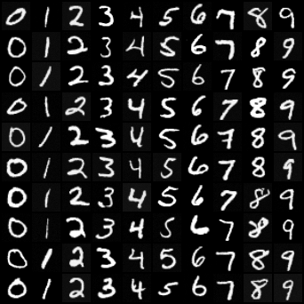
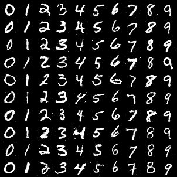

<h1 align="center">
  <b>Diffusion-GAN-VAE-Pytorch</b><br>
</h1>

A collection of generative models, including **Diffusion**(DDPM), **VAE**(variational autoencoders), and **GAN**(Generative Adversarial Networks), implemented in pytorch. The aforementioned models are all trained on the MINIST dataset, and thus everyone can easily try to run them, even with no cuda device (except for diffusion model, which require complex conv. layers). The aim of this project is for provide a quick and simple working example for the three main generative models, so that every newcomer in the AIGC area can dive into concrete code while reading introductory papers or tutorials.

Here are the results of each model.

**Diffusion**
<p align="center">
    
</p>

**GAN**
<p align="center">
    
</p>

**VAE**
<p align="center">
    
</p>

## Installation
```
git clone https://github.com/JoeLeelyf/Diffusion-GAN-VAE-Pytorch
cd Diffusion-GAN-VAE-Pytorch
conda create -n GenrativeModels
conda activate GenerativeModels
pip install -r requirements.txt
```

## Train
```
conda activate GenerativeModels
cd diffusion/GAN/VAE
python train.py
```
images generated by the models will be saved to the folder `./images/*`. And weight will be save to `./weight/*` for further evaluation

## Inference
```
conda activate GenerativeModels
cd diffusion/GAN/VAE
python sample.py
```

## Acknowledge
Most code are borrowed from exsiting GitHub projects, thanks to them!
| Model  | Paper          | Original Code |
|--------|----------------|---------------|
| Diffusion  |[DDPM](https://arxiv.org/abs/2006.11239) [DDIM](https://arxiv.org/abs/2010.02502) |[code](https://github.com/dome272/Diffusion-Models-pytorch)|
| GANs       |[GAN](https://arxiv.org/abs/1406.2661) [cGAN](https://arxiv.org/abs/1411.1784) |[code](https://github.com/eriklindernoren/PyTorch-GAN)|
| VAEs       |[VAE](https://arxiv.org/abs/1312.6114) [cVAE](https://arxiv.org/abs/2305.00980)|[code](https://github.com/AntixK/PyTorch-VAE)|